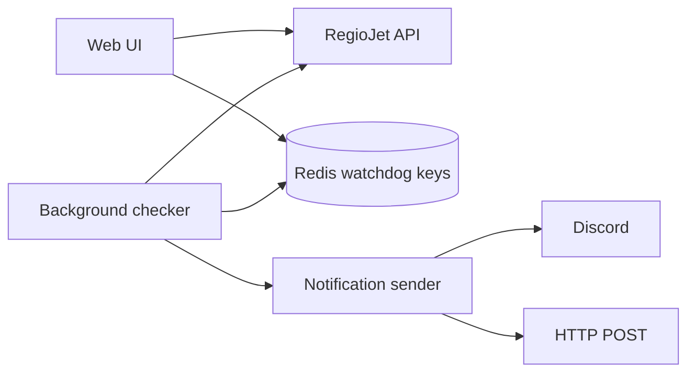

# RegioJet Watchdog

You know the situation: you check RegioJet for tomorrow, find the train you want, and then realize there are no seats left.

Sometimes that is not the end of the story. People cancel tickets. Seats open up later. And sometimes the full route is sold out, but smaller parts of the same train still have seats. For example, `Pardubice -> Bratislava` might be unavailable, while `Pardubice -> Brno` and `Brno -> Bratislava` are available separately. You stay on the same train, but change seats somewhere in the middle. Sometimes that can even be cheaper.

RegioJet Watchdog watches those routes for you. You run the app, search for a train, click `Watch`, and get a webhook notification when seats appear.

It does not book or reserve seats. It only tells you when something becomes available.

## What It Does

| For you | What that means |
| --- | --- |
| Watch a sold-out train | Pick a route and departure, then let the app keep checking it. |
| Notify you when seats appear | Send a Discord message or HTTP webhook when free seats are found. |
| Find same-train segment options | Optionally check whether parts of the same train can be booked separately. |
| Keep the setup local | Watchdogs are stored in your Redis instance, not in a hosted service. |
| Work from a browser | Use the web UI first. The JSON API is there if you want automation later. |

## The Usual Flow

1. Start Redis.
2. Start the Go app.
3. Open `http://localhost:7900`.
4. Search `From`, `To`, and departure date.
5. Enter a webhook URL.
6. Click `Watch` on the route you care about.
7. Leave the app running.

When the checker finds free seats, it sends a notification. The Redis key expires automatically at the train departure time.

## Quick Start

### Requirements

| Requirement | Why |
| --- | --- |
| Go | Runs the app. `go.mod` targets Go `1.23.0`. |
| Redis | Stores active watchdogs. |
| Webhook URL | Where notifications are sent. Discord is easiest. |
| Internet access | The app calls RegioJet public endpoints. |

### 1. Start Redis

The easiest local Redis setup is Docker:

```bash
docker run --rm -p 6379:6379 redis:7
```

If you already run Redis somewhere else, use that URL in `.env`.

### 2. Create `.env`

Create a `.env` file in the repository root:

```dotenv
REDIS_URL=redis://localhost:6379/0
PORT=7900
CHECK_INTERVAL_MINUTES=1
```

| Variable | Required | Default | What to set |
| --- | --- | --- | --- |
| `REDIS_URL` | Yes | none | Redis connection URL. |
| `PORT` | No | `7900` | Local HTTP port. |
| `CHECK_INTERVAL_MINUTES` | No | `1` | How often to check active watchdogs. Set `0` to disable background checks. |
| `ENV` | No | `development` | In development, `.env` is loaded automatically. |

### 3. Run The App

```bash
go run .
```

Open:

```text
http://localhost:7900
```

## Using The Web UI

The web UI is the main way to use the project.

### Search Routes

Use the station search fields:

| Field | What to do |
| --- | --- |
| `From` | Start typing a city or station name, then choose from the list. |
| `To` | Choose the destination station. |
| `Departure` | Pick the travel date. |

Click `Search routes`. The app shows matching departures, prices, and free seat counts.

### Add Webhook Settings

Before clicking `Watch`, configure where notifications should go.

| Webhook type | Use it when | Expected response |
| --- | --- | --- |
| `Discord` | You want messages in a Discord channel. | Discord returns `204 No Content`. |
| `HTTP POST` | You want to receive raw JSON in your own app. | Your endpoint should return `200 OK`. |

### Click Watch

Each route row has a `Watch` button. Clicking it creates a watchdog in Redis for that route. If a route is already watched, the row shows `Remove`.

## Check Segments

`Check segments` is for the annoying case where the full route is sold out but parts of the same train may still be bookable.

Example:

| Full route you want | Status |
| --- | --- |
| `Pardubice -> Bratislava` | Sold out |

The app can also check smaller same-train legs:

| Segment | Possible result |
| --- | --- |
| `Pardubice -> Brno` | Seats available |
| `Brno -> Bratislava` | Seats available |

That means you may be able to travel on the same train by booking separate tickets or changing seats mid-route.

## Notifications

### Discord

Use a Discord webhook URL and choose `Discord` in the UI. The app sends a Discord embed with route and seat information.

### HTTP POST

Use this if you are building another app around the watchdog. The app sends JSON to your endpoint.

When `Check segments` is disabled, your endpoint only needs to handle the direct-seat payload:

```json
{
  "route_details": {
    "priceFrom": 349,
    "priceTo": 719,
    "freeSeatsCount": 12,
    "departureCityName": "Bratislava",
    "arrivalCityName": "Pardubice",
    "travelTime": "03:38",
    "departureTime": "2026-05-02T05:17:00+02:00",
    "arrivalTime": "2026-05-02T08:55:00+02:00"
  },
  "departure_date": "02.05.2026",
  "fields": [
    {
      "name": "Vehicle Number: 6",
      "value": "Number of Free Seats: 12",
      "inline": true
    }
  ]
}
```

When `Check segments` is enabled, your endpoint should also handle alternative-segment payloads:

```json
{
  "route_info": {
    "from": "Pardubice - MS",
    "to": "Bratislava - MS",
    "price": "349.00",
    "departureTime": "05:17",
    "arrivalTime": "08:55",
    "freeSeats": "12",
    "departureDate": "02.05.2026"
  },
  "fields": [
    {
      "name": "Alternative route with Total Price: 698.00 CZK",
      "value": "**Pardubice - MS -> Brno - MS** ...",
      "inline": false
    }
  ]
}
```

## How It Works Internally



| Part | Responsibility |
| --- | --- |
| Web UI | Search routes and create/remove watchdogs. |
| Redis | Store active watchdogs until departure. |
| Checker | Periodically check active watchdogs. |
| Notification sender | Send Discord or HTTP POST notifications. |
| RegioJet API | Source of station, route, and seat availability data. |

## Running Notes

| Topic | Detail |
| --- | --- |
| Persistence | Watchdogs are stored as Redis keys matching `watchdog:<routeID>:<subscriptionID>`. |
| Expiration | Watchdogs expire at the train departure time. |

## Troubleshooting

| Problem | What to check |
| --- | --- |
| App says `REDIS_URL must be set` | Create `.env` or export `REDIS_URL`. |
| Redis connection panic | Make sure Redis is running and `REDIS_URL` is correct. |
| Browser opens but stations/routes fail | RegioJet may be unavailable. Retry later. |
| Watchdog never fires | Make sure `CHECK_INTERVAL_MINUTES` is greater than `0`. |
| Discord notification fails | Use `Discord` type and a real Discord webhook URL. |
| HTTP POST notification fails | Your endpoint must accept JSON and return `200 OK`. |

## API Appendix

Most users should use the web UI. These endpoints are useful for scripts or integrations.

| Endpoint | Method | Purpose |
| --- | --- | --- |
| `/constants` | `GET` | List train station IDs. |
| `/routes` | `GET` | Search routes by station IDs and date. |
| `/watchdog` | `POST` | Create a watchdog. |
| `/watchdog/remove` | `POST` | Remove one watchdog subscription. |

### Get Stations

```http
GET /constants
```

```json
{
  "372825002": "Pardubice - MS",
  "1841058000": "Bratislava - MS"
}
```

### Search Routes

```http
GET /routes?stationFromID=372825002&stationToID=1841058000&departureDate=02.05.2026
```

| Query Param | Required | Description |
| --- | --- | --- |
| `stationFromID` | Yes | Source station ID from `/constants`. |
| `stationToID` | Yes | Destination station ID from `/constants`. |
| `departureDate` | Yes | RegioJet date format, usually `DD.MM.YYYY`. |

```json
[
  {
    "id": "6618452367",
    "departureTime": "08:12",
    "arrivalTime": "11:18",
    "priceFrom": 349,
    "priceTo": 719,
    "bookable": true,
    "freeSeatsCount": 12,
    "watchdog": false
  }
]
```

### Create Watchdog

```http
POST /watchdog
Content-Type: application/json
```

```json
{
  "stationFromID": "372825002",
  "stationToID": "1841058000",
  "routeID": "6618452367",
  "webhookURL": "https://discord.com/api/webhooks/...",
  "webhookType": "discord",
  "checkSegments": true
}
```

| Field | Required | Description |
| --- | --- | --- |
| `stationFromID` | Yes | Source station ID. |
| `stationToID` | Yes | Destination station ID. |
| `routeID` | Yes | Route ID from `/routes`. |
| `webhookURL` | Yes | Destination webhook URL. |
| `webhookType` | Yes | `discord` or `simple`. `simple` means HTTP POST JSON. |
| `checkSegments` | No | Enables same-train segment search. |

Response:

```json
{
  "message": "Watchdog set successfully.",
  "subscriptionID": "c1096e0a3f3d4a3f9b1f0f40f2e7cf22"
}
```

Keep `subscriptionID` if you want to remove this exact subscription through the API later.

### Remove A Watchdog Subscription

```http
POST /watchdog/remove
Content-Type: application/json
```

```json
{
  "routeID": "6618452367",
  "subscriptionID": "c1096e0a3f3d4a3f9b1f0f40f2e7cf22"
}
```

| Field | Required | Description |
| --- | --- | --- |
| `routeID` | Yes | Route ID from the original watchdog. |
| `subscriptionID` | Yes | Subscription ID returned by `POST /watchdog`. |

## Development

The UI is rendered with Go `templ` components and HTMX. Static assets are embedded into the Go binary from `internal/ui/assets`.

Regenerate templ output after editing `.templ` files:

```bash
go run github.com/a-h/templ/cmd/templ@v0.3.960 generate
```

Run checks:

```bash
go test ./...
go vet ./...
```

## Project Status

This is a personal utility around unofficial/public RegioJet endpoints. Treat it as best-effort monitoring, not a guaranteed booking system.
